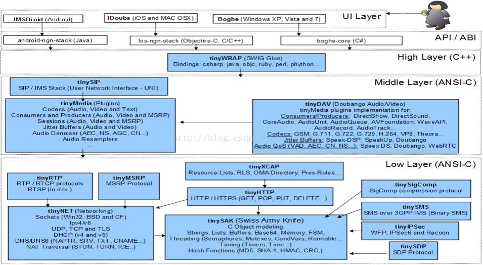

# iOS集成SIP功能

## doubango架构图



## 下载doubango/idoubs代码

```
$ mkdir mydoubs
$ cd mydoubs
$ git clone https://github.com/DoubangoTelecom/doubango.git doubango
$ git clone https://github.com/DoubangoTelecom/idoubs.git idoubs
```

## 编译代码

### ios-ngn-stack

使用XCode打开`idoubs/ios-ngn-stack/ios-ngn-stack.xcodeproj`。
修改 Build Setting/Build Option/Enable Bitcode，从Yes改为No，否则后面会报错：
-fembed-bitcode is not supported on versions of iOS prior to 6.0

### idoubs

使用XCode打开`idoubs/ios-ngn-stack/ios-ngn-stack.xcodeproj`。
修改General/identity/Bundle Identifier，随意修改，如`cn.ceyes.idoubs`

## 运行代码

### idoubs

可以直接在手机上运行，暂未找到配置在哪儿

### tests

需要添加 opengl 相关的lib

#### testAudioCall

Run testAudioCall， 报错

```
ld: -pie can only be used when targeting iOS 4.2 or later
clang: error: linker command failed with exit code 1 (use -v to see invocation)
```

搜`deployment`，将`iOS deploy target`修改为>4.2的数字，如`iOS 7.1`。
注意，有多处，只有`ios-ngn-stack`的该值是4.0，改为`iOS 7.1`。
改后出现43个错如下，

```
Undefined symbols for architecture x86_64:
  "_OBJC_CLASS_$_CADisplayLink", referenced from:
      objc-class-ref in libios_ngn_stack.a(iOSGLView.o)
  "_OBJC_CLASS_$_CAEAGLLayer", referenced from:
      objc-class-ref in libios_ngn_stack.a(iOSGLView.o)
  "_OBJC_CLASS_$_EAGLContext", referenced from:
      objc-class-ref in libios_ngn_stack.a(iOSGLView.o)
  "_glActiveTexture", referenced from:
      -[iOSGLView render:] in libios_ngn_stack.a(iOSGLView.o)
  "_glAttachShader", referenced from:
      -[iOSGLView compileShaders] in libios_ngn_stack.a(iOSGLView.o)
  "_glBindBuffer", referenced from:
      -[iOSGLView setupVBOs] in libios_ngn_stack.a(iOSGLView.o)
  "_glBindFramebuffer", referenced from:
      -[iOSGLView updateSizes] in libios_ngn_stack.a(iOSGLView.o)
      -[iOSGLView setupFrameBuffer] in libios_ngn_stack.a(iOSGLView.o)
  "_glBindRenderbuffer", referenced from:
      -[iOSGLView updateSizes] in libios_ngn_stack.a(iOSGLView.o)
      -[iOSGLView setupRenderBuffer] in libios_ngn_stack.a(iOSGLView.o)
  "_glBindTexture", referenced from:
      -[iOSGLView initialize] in libios_ngn_stack.a(iOSGLView.o)
      -[iOSGLView render:] in libios_ngn_stack.a(iOSGLView.o)
  "_glBufferData", referenced from:
      -[iOSGLView setupVBOs] in libios_ngn_stack.a(iOSGLView.o)
  "_glClear", referenced from:
      -[iOSGLView render:] in libios_ngn_stack.a(iOSGLView.o)
  "_glCompileShader", referenced from:
      -[iOSGLView compileShader:withType:] in libios_ngn_stack.a(iOSGLView.o)
  "_glCreateProgram", referenced from:
      -[iOSGLView compileShaders] in libios_ngn_stack.a(iOSGLView.o)
  "_glCreateShader", referenced from:
      -[iOSGLView compileShader:withType:] in libios_ngn_stack.a(iOSGLView.o)
  "_glDeleteProgram", referenced from:
      -[iOSGLView dealloc] in libios_ngn_stack.a(iOSGLView.o)
  "_glDeleteRenderbuffers", referenced from:
      -[iOSGLView updateSizes] in libios_ngn_stack.a(iOSGLView.o)
      -[iOSGLView dealloc] in libios_ngn_stack.a(iOSGLView.o)
  "_glDeleteShader", referenced from:
      -[iOSGLView dealloc] in libios_ngn_stack.a(iOSGLView.o)
  "_glDeleteTextures", referenced from:
      -[iOSGLView dealloc] in libios_ngn_stack.a(iOSGLView.o)
  "_glDisable", referenced from:
      -[iOSGLView initialize] in libios_ngn_stack.a(iOSGLView.o)
  "_glDrawElements", referenced from:
      -[iOSGLView render:] in libios_ngn_stack.a(iOSGLView.o)
  "_glEnable", referenced from:
      -[iOSGLView initialize] in libios_ngn_stack.a(iOSGLView.o)
  "_glEnableVertexAttribArray", referenced from:
      -[iOSGLView compileShaders] in libios_ngn_stack.a(iOSGLView.o)
  "_glFramebufferRenderbuffer", referenced from:
      -[iOSGLView updateSizes] in libios_ngn_stack.a(iOSGLView.o)
      -[iOSGLView setupFrameBuffer] in libios_ngn_stack.a(iOSGLView.o)
  "_glGenBuffers", referenced from:
      -[iOSGLView setupVBOs] in libios_ngn_stack.a(iOSGLView.o)
  "_glGenFramebuffers", referenced from:
      -[iOSGLView setupFrameBuffer] in libios_ngn_stack.a(iOSGLView.o)
  "_glGenRenderbuffers", referenced from:
      -[iOSGLView updateSizes] in libios_ngn_stack.a(iOSGLView.o)
      -[iOSGLView setupRenderBuffer] in libios_ngn_stack.a(iOSGLView.o)
  "_glGenTextures", referenced from:
      -[iOSGLView initialize] in libios_ngn_stack.a(iOSGLView.o)
  "_glGetAttribLocation", referenced from:
      -[iOSGLView compileShaders] in libios_ngn_stack.a(iOSGLView.o)
  "_glGetProgramInfoLog", referenced from:
      -[iOSGLView compileShaders] in libios_ngn_stack.a(iOSGLView.o)
  "_glGetProgramiv", referenced from:
      -[iOSGLView compileShaders] in libios_ngn_stack.a(iOSGLView.o)
  "_glGetRenderbufferParameteriv", referenced from:
      -[iOSGLView updateSizes] in libios_ngn_stack.a(iOSGLView.o)
      -[iOSGLView setupFrameBuffer] in libios_ngn_stack.a(iOSGLView.o)
  "_glGetShaderInfoLog", referenced from:
      -[iOSGLView compileShader:withType:] in libios_ngn_stack.a(iOSGLView.o)
  "_glGetShaderiv", referenced from:
      -[iOSGLView compileShader:withType:] in libios_ngn_stack.a(iOSGLView.o)
  "_glGetUniformLocation", referenced from:
      -[iOSGLView compileShaders] in libios_ngn_stack.a(iOSGLView.o)
  "_glLinkProgram", referenced from:
      -[iOSGLView compileShaders] in libios_ngn_stack.a(iOSGLView.o)
  "_glShaderSource", referenced from:
      -[iOSGLView compileShader:withType:] in libios_ngn_stack.a(iOSGLView.o)
  "_glTexImage2D", referenced from:
      -[iOSGLView render:] in libios_ngn_stack.a(iOSGLView.o)
  "_glTexParameteri", referenced from:
      -[iOSGLView initialize] in libios_ngn_stack.a(iOSGLView.o)
  "_glUniform1i", referenced from:
      -[iOSGLView render:] in libios_ngn_stack.a(iOSGLView.o)
  "_glUseProgram", referenced from:
      -[iOSGLView compileShaders] in libios_ngn_stack.a(iOSGLView.o)
  "_glVertexAttribPointer", referenced from:
      -[iOSGLView initialize] in libios_ngn_stack.a(iOSGLView.o)
  "_glViewport", referenced from:
      -[iOSGLView render:] in libios_ngn_stack.a(iOSGLView.o)
ld: symbol(s) not found for architecture x86_64
clang: error: linker command failed with exit code 1 (use -v to see invocation)
```

在`Build Phases`中添加`OpenGLES.framework`，重编，剩余3个报错：

```
Undefined symbols for architecture x86_64:
  "_OBJC_CLASS_$_CADisplayLink", referenced from:
      objc-class-ref in libios_ngn_stack.a(iOSGLView.o)
  "_OBJC_CLASS_$_CAEAGLLayer", referenced from:
      objc-class-ref in libios_ngn_stack.a(iOSGLView.o)
ld: symbol(s) not found for architecture x86_64
clang: error: linker command failed with exit code 1 (use -v to see invocation)
```

再加上`QuartzCore.framework`，编译不报错了，但是运行起来就报错。

```
2016-06-05 17:25:49.867 testAudioCall[10042:277308] *** Assertion failure in -[UIApplication _runWithMainScene:transitionContext:completion:], /BuildRoot/Library/Caches/com.apple.xbs/Sources/UIKit/UIKit-3512.30.14/UIApplication.m:3315
2016-06-05 17:25:49.866 testAudioCall[10042:277547] NgnSipService///: Stack started
*[DOUBANGO INFO]: OnDialogEvent(Dialog connecting, 1)
*[DOUBANGO INFO]: OnDialogEvent((un)REGISTER request successfully sent., 1)
2016-06-05 17:25:49.871 testAudioCall[10042:277308] *** Terminating app due to uncaught exception 'NSInternalInconsistencyException', reason: 'Application windows are expected to have a root view controller at the end of application launch'
*** First throw call stack:
(0x1814c9900 0x180b37f80 0x1814c97d0 0x181e3c99c 0x186464ac0 0x1864615c0 0x182a7f790 0x182a7fb10 0x181480efc 0x181480990 0x18147e690 0x1813ad680 0x18622a580 0x186224d90 0x100080b14 0x180f4e8b8)
libc++abi.dylib: terminating with uncaught exception of type NSException

```

#### testPresence

同`testAudioCall`的处理

#### testAudioUnit

同`testAudioUnit`的处理


#### testRegistration

Run testRegistration， 报错

```
Undefined symbols for architecture i386:
  "_OBJC_CLASS_$_NgnEngine", referenced from:
      objc-class-ref in TestRegistration.o
ld: symbol(s) not found for architecture i386
clang: error: linker command failed with exit code 1 (use -v to see invocation)
```

## 构建demo应用

### 创建SingleView的App

常规默认创建，重点在保存路径，记得和`ios-ngn-stack`目录平行，即同一个父目录。

### 将`ios-ngn-stack`添加为项目引用

关闭XCode打开的其他项目，只保留当前的demo项目。
将`ios-ngn-stack.xcodeproj`从finder中拖放到demo项目内。

### 添加依赖

在demo项目的Build Phases中，在`Target Dependencies`里添加各种需要的内容。

- ios-ngn-stack
- tinyBFCP
- tinySAK
- tinyNET
- tinySDP
- tinyRTP
- tinyIPSec
- tinyMSRP
- tinyHTTP
- tinyMEDIA
- tinySIGCOMP
- tinySMS
- tinyXCAP
- tinySIP
- tinyDAV
- tinyWRAP

如果不关闭其他项目，很可能`ios-ngn-stack`项目也是打开状态，那么点击+号，下面就是空的。

### 添加链接库

在demo项目的Build Phases中，在`Link Binary With Libraries`里添加各种需要的内容。

- libios_ngn_stack.a
- libtinyBFCP.a
- libtinySAK.a
- libtinyNET.a
- libtinySDP.a
- libtinyRTP.a
- libtinyIPSec.a
- libtinyMSRP.a
- libtinyHTTP.a
- libtinyMEDIA.a
- libtinySIGCOMP.a
- libtinySMS.a
- libtinyXCAP.a
- libtinySIP.a
- libtinyDAV.a
- libtinyWRAP.a

除此之外，还需要添加Foundation的库，包括如下：

- QuartzCore.framework
- OpenGLES.framework
- Security.framework
- CFNetwork.framework
- AudioToolbox.framework
- AddressBook.framework
- CoreGraphics.framework
- AVFoundation.framework
- CoreMedia.framework
- CoreVideo.framework
- SystemConfiguration.framework

### 配置`Build Settings`

#### User-Defined

添加如下自定义的环境变量

```
DOUBANGO_HOME = ../../doubango

DOUBANGO_INCLUDES = $DOUBANGO_HOME/tinySDP/include $DOUBANGO_HOME/tinySMS/include $DOUBANGO_HOME/tinyHTTP/include $DOUBANGO_HOME/tinySIP/include $DOUBANGO_HOME/tinyRTP/include $DOUBANGO_HOME/tinyMEDIA/include $DOUBANGO_HOME/tinyNET/src $DOUBANGO_HOME/tinyDAV/include $DOUBANGO_HOME/thirdparties/iphone/include $DOUBANGO_HOME/thirdparties/common/include

DOUBANGO_LIBS = $DOUBANGO_HOME/thirdparties/iphone/lib/universal

NGN_STACK_HOME = ..

PREBINDING = NO

ZERO_LINK = NO
```

#### Linking/Other Linker Flags

下面内容都是在一行里面

```
-lsrtp
-lssl
-lcrypto
-lyuv
-lvpx
-lx264
-lopenh264
-lswscale
-lavutil
-lavcodec
-lopus
-lgsm
-lg729b
-lspeex
-lspeexdsp
-framework Foundation
-framework UIKit
```

#### Search Paths/Header Search Paths

下面内容都是在一行里面

```
../common-ngn-stack 
../ios-ngn-stack 
$DOUBANGO_INCLUDES
```

#### Search Paths/Library Search Paths

```
$DOUBANGO_LIBS
```

#### Apple LLVM 7.1 - Custom Compiler Flags / Other C Flags

下面内容都是在一行里面

```
-fms-extensions
-DRECYCLE_STACK=1
-DDEBUG_LEVEL=DEBUG_LEVEL_INFO
-DHAVE_SPEEX_DSP=1
-DHAVE_SPEEX_DENOISE=1
-DHAVE_LIB_SPEEX=1
-DHAVE_SPEEX_JB=1
-DHAVE_LIBOPUS=1
-DHAVE_LIBGSM=1
-DHAVE_G729=1
-DHAVE_COREAUDIO_AUDIO_UNIT=1
-DHAVE_COREAUDIO_AUDIO_QUEUE=0
-DHAVE_FFMPEG=1
-DHAVE_LIBVPX=1
-DHAVE_OPENH264=1
-DHAVE_LIBYUV=1
-DHAVE_SWSSCALE=0
-DHAVE_OPENSSL=1
-DHAVE_SRTP=1
```

#### Apple LLVM 7.1 - Custom Compiler Flags / Other C++ Flags

```
$(OTHER_CFLAGS)
```

### 加入头文件

在`ViewController.h`中，加入头文件

```
#import "iOSNgnStack.h"
```


## 参考文献

- [idoubs/Building_iDoubs_v2_x.md](https://github.com/DoubangoTelecom/idoubs/blob/master/Building_iDoubs_v2_x.md)
- [idoubs DevelopersGuide学习笔记](http://blog.csdn.net/yuanbohx/article/details/8754574)
- [idoubs安装与配置](http://wenku.baidu.com/view/0ede21711711cc7931b716d5.html)
- [基于Doubango的iOS客户端开源框架](http://leopard168.blog.163.com/blog/static/16847184420139215540627/)
- [doubango简介](http://www.cnblogs.com/fuland/p/3654834.html)
- [idoubs 注册逻辑 学习笔记](http://blog.csdn.net/yuanbohx/article/details/8906142)
- [idoubs/DevelopersGuide.md](https://github.com/DoubangoTelecom/idoubs/blob/master/DevelopersGuide.md)