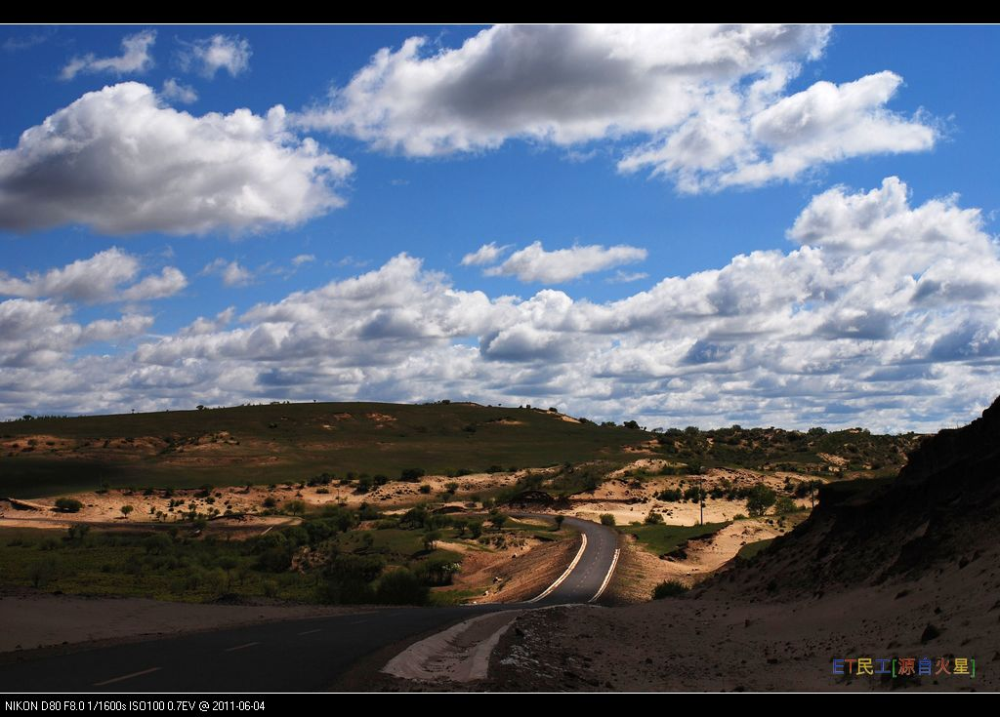

# 绿野永不倒，驴友当自强

## 1. 起因

惊闻绿野ORG又倒下了。

> 2016年5月24日，绿野户外网站(lvye.org)无法打开，网站管理员收到工业和信息化部网站备案系统-短信通知：“您备案信息中的网站绿野户外已被注销，该网站的备案号京ICP证041227号-1已被收回，注销理由为有违规行为（北京市人民政府新闻办公室来函，2016年第0015号，原因：仿冒他人网站，发布虚假宣传信息，违反《互联网新闻信息服务管理规定》及《互联网信息服务管理办法》。），特此通知！”

作为早期的户外网站，绿野ORG秉持自助+非商业的理念，始终坚持小众路线。
具体情况，可参考卡尔松的长文[《绿野org：因“仿冒”被关的传奇故事》](http://blog.sina.cn/dpool/blog/s/blog_6d12cf490102wfiv.html?uid=0&from=timeline&isappinstalled=0)
这种理想主义的情怀，在当今资本长袖善舞的社会里，的确有些格格不入。
关于这次事件的各种分析我就不提了，简单回忆下我在绿野ORG度过的青葱岁月吧。

## 2. 加入绿野

最早听说绿野，还是03年那会儿。
刚参加工作，正是有闲没钱的状态。
有同事也是新驴，参加了一次去不老屯的休闲之旅，回来赞不绝口。
“我们找村民买了几只鸡现做，香！”
老玉米眯着眼睛，砸吧着嘴，无限回味。
然而那会儿的我并不是个吃货。
“关键是参加绿野的活动巨便宜！都是AA！”
瞬间打动我了。

从此进入了绿野青春期。
周末雷打不动的参加户外活动。
经常连续两天都是强度1.5的一日穿越。
时不时来个两日的扎营。
逢长假还要整个远期自助。
工作之余也会偷偷刷下建设版。
现在回想起来还是甜到忧伤。

## 3. 我的第一次

### 第一次绿野活动 + 第一次P掉

2003/09/20 mef队 狼儿峪-妙峰山-大觉寺

从未参加过户外活动的我，怀着忐忑不安的心情，一路走的跌跌撞撞。
两枚队友穿着凉鞋，背着西瓜，一路都在讨论什么时候该补肌酸。
而我却早已P掉，涧沟村就屁滚尿流的下撤了。

但是垭口的风景，的确不错。

### 第一次徒步穿越隧道 + 最狠的一次减肥

2004/04/03 蒸汽机+foanne*小丸子队，实际带队发电机:) 狼儿峪-妙峰山-大觉寺-……模式口

这次从早上走到晚上，时间和距离都创新高。
走到后来肚子不配合，又不想拉野翔，只好夹着尾巴走，真是快走P了。
途中穿越了一条隧道，不长，也就几公里。
担心有火车经过，所以走的提心吊胆，一直支着耳朵。
真正体验到了什么是黑到极致。
只有头灯和手电照到的地方有一点亮。
扭头看，会融化到黑暗中。
真正的伸手不见五指。

最终穿越到隧道出口，逐渐见到光明的感觉，真好。

### 第一次户外长线 + 第一次见到草原 + 第一次见到沙漠

2004/05/01 - 2004/05/05 血狼队，内蒙、山西游

开的飞快的依维柯里欢声笑语，草原、湿地、沙漠、石窟依次经过。
背着包滑沙，沙漠里的金字塔。

原来外面的世界是这样的。

### 第一次体验穿越基本靠手

2004/06/12 破网队，抓髻山-清水尖 一日穿越

一日穿越，却走成了一日半的。
树杈太密，路线不好辨认，稍不小心就偏离大路。
走两步都找不到人，背着包阻力又大。
通讯基本靠吼，交通基本靠走，穿越非得靠手，全是树杈啊~~~
探路、开路、夜路……

总有意想不到的。

### 第一次小五台 + 第一次户外迷路

2004/09/18-20 原上草队 小五台 东沟-东台-西台 

原计划只是2日的常规活动，没想到活生生拖成了3日。
当夕阳西下，身边是断崖。
瀑布哗啦啦，我们已累叉。
感谢唐门暗器、小P临危不惧。
带领大家杀出绝望谷，在山中度过难忘一夜。
小五的夜晚是澄静的，银河近在眼前。
用别人喝过小二的套锅煮酸辣粉，醉了一宿。

还是想不明白3人帐是怎么躺下8个人的。

### 第一次爬断崖

2004/10/23-24 蒸汽机队 刘家峪-柏峪-黄草梁-椴木沟

两个断崖挺爽啊，人定胜天的感觉。

### 第一次写攻略

2004/10/30 “人民工舍.甲”队第6次活动 “香植拉”香山-植物园-必胜客沙拉塔

第一次写的攻略，不是户外路线，而是必胜客沙拉塔堆叠技巧攻略。

我只邮件发给了几个好友，没想到后来竟然惊动了海外媒体……

### 第一次穿越沙漠

2005_05_02~06 全天候队，库布其沙漠穿越

出行时未雇到骆驼，只好自己背水。
汽油桶装水，怎么喝都是一股塑料味。
从南向北走的坏处是一路都是从背风面翻沙丘。
辛辛苦苦爬半天，一放松就又掉到原地了，实在太有挫败感。
行至三分之一强，因存水紧张，加之有队友身体不适，决定回撤。
回撤途中看到别的队，竟然前后队拉开很远，简直不可理喻。
于是大家力劝连指南针都没有的队员跟我们一起回撤。
沙漠里的扎营，早起发现昨天的脚印早已消散在风中。
如果没有GPS……不敢想。

渴疯了的我连尿都舍不得撒，满脑子冰镇大西瓜。

### 第一次彻底湿身 + 第一次远观三峡大坝

2006/04/30 - 05/07 往事+Bug995队，神农架穿越

完美的行程，包括最后一天的雷雨冰雹下撤。
背包穿鞋游泳下山，彻底湿身。
从头到脚，连内裤都湿透透。
山脊夺命狂奔，炸雷就在头顶咔咔响。
在农用车后面的大家，头顶始终笼罩着白烟。
深圳队上山途中遭遇雷雨，竟然用登山杖搭凉棚。
结果滚地雷打过来，有队员裤子都烧穿了。
他们请的“著名”向导还忽悠说喝白酒能防蚂蝗。
也是命大。
在宜昌远观三峡大坝，尚未建完。
晚上下起了小雨，差点回不去住处。

痛定思痛，回去就买了Gore-Tex的鞋。

### 第一次头顶滚落飞石

2006/10/01-07 行者无疆队，贺兰山-银川

摸黑冒着滚石背大包爬60度大坡+走夜路。
拍摄《大话西游》的镇北堡影视城。
银川竟然有一个山寨天安门。
神秘的西夏王陵。

再地道的羊肉，我的胃也能原封不动的顶出来。

### 第一次目睹抱石

2006_11_04-05 白河岩场目睹抱石

没有抱石者翻不上的墙。

### 第一次高海拔徒步

2007/05 Bug995+往事队 贡嘎转山

高反+头疼+低烧+人中溃烂。
背着大包，迈着缓慢而坚定的步伐，目送向导悠闲的渐行渐远。
忘不了永远“还有4小时”就到的贡嘎寺。
忘不了触手可及的贡嘎雪山。
还有进山时意气风发，出山时衣衫褴褛的骑车少年。
脉动瓶里的草科鸡汤真香。

有一种自豪，是背着大包与骑马游客擦身而过。

### 第一次看到油菜花

2008/04/03-06 招财队 清明婺源行

黄澄澄的油菜花看到审美疲劳，徽派村落也还不错了。
进村竟然要收费，无奈只好翻山进村。
第一次搭冷藏车，一群人挤在只有小小一扇窗的车厢里。

香菇油菜的油菜到底和油菜花是不是一回事儿？

### 第一次骑行

2008/04/30-05/05 白猫队 五一青海湖鸟岛

老酸奶名不虚传，好好喝。
西宁城中有汉传佛教的庙宇、藏传佛教的喇嘛庙、清真寺、教堂。
旅店旁边山上就是喇嘛庙，只有俩喇嘛值班。
现场观摩了诵经仪式，蛮认真的。
鸟岛搭警车离岛，也是脸皮厚。

骑车环青海湖一日往返67km，美景虽美，屁股真疼。

### 第一次6日穿越

2009/10/01-10/07 往事/Bug995队 鳌太穿越

连走六天，彻底累P了。
好在有GPS的精确轨迹。
即使在黑夜里或是浓雾中，也能顺利导航。
大海航行，终于不用靠剁手了。

感谢GPS！

### 第一次挂彩

2011/06/04-06/06 往事队，浑善达克沙地穿越

作为二队轻装只走一天感觉毫无压力，里程42km。
沙地走起来比机耕道费劲多了。
跨越式过铁丝网挂彩，裤子和屁股都挂破，差点真相大白。

不作死就不会死。

## 4. 总结

如果不是绿野ORG网站挂掉，不知道什么时候才会写这样一篇文章。
自虐的活动如果能死磕下来，美景和快乐也会加倍的补偿。
只有曾经痛苦过，回忆才会带着甜蜜。
同行的朋友，有的已经记不得名字。
但忘不掉的，也不必时刻保持联系。

**因为山在那里，心就在那里。**
**绿野永不倒，驴友当自强。**

## 5. 附录

### 如何查找自己的绿野履历

作为驴友，此时也许希望查看自己的履历。
比方说我，此刻就想参考履历写点儿和绿野的往事。
可是网站被封，这该如何是好呢？

答案是使用谷歌的缓存，当然了，国内需要科学上网（推荐Lantern）。
在谷歌搜索框中输入`老纳 的帐号信息  site:www.lvye.org`，注意，将`老纳`替换为自己的绿野ID。
往往第一条搜索结果就是想要的。
点击链接右侧的小三角，选择下拉菜单的`网页快照`，即可进入谷歌的缓存页面。
当然，图片就不要考虑了。
顺便说一句，同样的关键字我也试了百度，没戏。

同样道理，在网站恢复访问之前，也可以挽回其他重要信息。

### 不完全履历

- 2003/09/20 mef队 狼儿峪-妙峰山-大觉寺 一日穿越，因扭伤中途于涧沟村下撤。

- 2003/10/04 一片冰心队 中香巴拉 一日穿越，第一次穿越成功。

- 2003/10/18 wolfhaha队 潭杯山潭柘寺一日穿越。

- 2003/10/25 viva2000队 狼儿峪-妙峰山-大觉寺-…… 一日穿越，到大觉寺完成自定任务。

- 2003/11/22 橘子队 抓髻山一日

- 2003/12/14 阿日队 北大滑冰培训 第一次滑水冰，10分钟内能够行走，半小时勉强直行。完成自定任务。

- 2004/02/28 伙同三五好友妙峰山溜达

- 2004/03/27 JOANSELF队，涧沟村-阳台山-凤凰岭 1.5级

- 2004/04/03 蒸汽机+foanne*小丸子队，实际带队发电机:) 狼儿峪-妙峰山-大觉寺-……模式口 一日穿越，第一次穿隧道晒月亮走夜路，暴爽！

- 2004/04/10 Vivia2000队，香山-植物园

- 2004/04/17 阿桂队，香山-东山-新望京-植物园

- 2004/04/24 自己走，香山-东山-新望京-植物园

- 2004/05/01 - 2004/05/05 血狼队，内蒙、山西游，第一次见到草原、穿过沙漠，爽毙了！

- 2004/05/22 自组“人民工舍.甲”队第1次活动，5人，狼儿峪-妙峰山-涧沟村-阳台山-鹫峰-大觉寺，大家走的都挺爽

- 2004/05/29-30 全天候、血狼 队，云蒙山2日，第一次2日活动，虽然背着70L大包，但是感觉还没走开，就帮田野背包走了一段，有点小爽了~~~

- 2004/06/04 “人民工舍.甲”队第2次活动，香山-东山-西杨陀-新望京-四棵树-植物园，13人，5人走完全程，和DUN背西瓜负重练习，达到练习目的。

- 2004/06/05 畅游队，狼儿峪-妙峰山-白宫-大风口-凤凰岭，6月4号、5号连续两天走，练习体能，为登小五台做准备。

- 2004/06/12 破网队，抓髻山-清水尖 一日穿越，却走成了1日半的，探路、开路、夜路……爽！通讯基本靠吼，交通基本靠走，穿越非得靠手（全是树杈啊~~~）……

- 2004/06/19 “人民工舍.甲”队第3次活动，狼儿峪-妙峰山-白宫-大风口-凤凰岭，7人，2人在妙峰山跑到大觉寺,5人走完全程，经发电机前辈指出一条新路，达到雨中练习目的。不过鞋子全湿了,不太爽啊~~~

- 2004/07/03 黑鸟队 大小海陀-啤酒溪。梦中的草甸，2千多米的海拔，上层次了，上层次了。

- 2004/07/10 “人民工舍.甲”队第4次活动，香山-挂甲塔-香山水库-八大处-模式口，7人，基本上就是走防火道遛弯，强度甚低啊~~~~还好，回来的早，没有被暴雨淋到……

- 2004/07/17 第一次睡过头！深切自责！误了mef的磨盘山队，只好自己一个人香山溜达去了，碰上了火流星骑车子，就蹭车玩了会儿，冲下坡的时候好怕怕，真的不敢松开闸啊~在新望京和海陀的理想、磨盘山的mef、丹佛通联了，呵呵，6388效果不错啊~

- 2004/08/29 香山邮局-新望京-西杨陀-东山-打鹰洼-香山邮局，脚指甲脱落之后第一次恢复性训练。

- 2004/09/04-05 血狼队 啤酒溪-海陀-西大庄科 2日，刚买帐篷，可惜它的第一次被别人给……

- 2004/09/18-20 原上草队 小五台 东沟-东台-西台 3日。第一次小五台，有惊无险，感谢唐门暗器、小P带领大家杀出绝望谷，在山中度过难忘一夜。风大的快疯乐，还是想不明白3人帐是怎么躺下8人的：）

- 2004/10/16 队 “人民工舍.甲”队第5次活动 狼儿屿－妙峰山－大觉寺，呵呵，成功走通：）

- 2004/10/23-24 蒸汽机队 刘家峪-柏峪-黄草梁-椴木沟，两个断崖挺爽啊：）

- 2004/10/30 “人民工舍.甲”队第6次活动 “香植拉”香山-植物园-必胜客沙拉塔，完成必胜客沙拉塔堆叠技巧攻略。

- 2004/11/21 血狼队 潭柘寺-龙潭，为了躲开护林员，绕了一个好大好大的圈圈……

- 2004/12/11 Viva2000队 决战香八拉之十字穿梭，因腿伤复发于孟悟提前下撤，咱不和身体较劲：）

- 2005_04_02 大雨不停 轻骑兵队 奔向春天的白河，强度是不高的，上升是没有的

- 2005_05_02~06 全天候队，库布其沙漠穿越。未雇到骆驼，只好自己背水，行至三分之一强因水紧张决定回撤。受益良多！最难忘的恳谈会……

- 2005_05_28 香八拉小走一个。负重导致腿伤复发，寻思去医院看看了……

- 2005_09_17-18 原上草队，小五百慕大。西沟1700扎营看家休闲FB，晚上晒月亮……

- 2005_10_15 润雪无痕队，九龙山。奇异的马蹄印，怀疑是酸性流水腐蚀了铁矿石造成的，鬼知道。后来查资料，认定这就是“冰臼”

- 2006/01/02 大雨不停队，白河一日。第一次在冰上起火，第一次冰河失足。还好，只湿了一条腿。

- 2006/04/30 - 05_07 往事+Bug995队，神农架穿越。完美的行程，包括最后一天的雷雨冰雹下撤。背包穿鞋游泳下山，彻底湿身。

- 2006/09/17 阿彪队，十三陵读史一日徒步连穿十三陵。虽然脚底板起泡，但是听各位讲明史很受教。

- 2006/09/24 自己走，十三陵一日连穿

- 2006/10/01-07 行者无疆队，贺兰山-银川。摸黑冒滚石背大包爬60度大坡+走夜路，过瘾了。

- 2006/11/25 红色侦察兵队 房山 白水寺。冬天的第一场雪。

- 2006/12/09 航天北极星队 水闸-小狗之家-九龙驾校-圈门。路上真的有野猪吗？

- 2007/01/01 黄山行，见奇景。

- 2007/01/06 水闸-小狗之家-九龙驾校-圈门。真的碰见鬼打墙！！！忘带黑驴蹄子了……

- 2007/04/14-15 Bug995+往事队 下马威～东灵山～北灵山～黄草梁～柏峪，两日负重穿越，为五一贡嘎穿越的拉练活动。上升下降俺都能忍，唯独走大马路忍不住P了……

- 2007/05 Bug995+往事队 贡嘎转山，高反/头疼/低烧/烂人中

- 2007/05/19 Mef队 妙峰山-阳台山-鹫峰 目击日晕

- 2007/07/21 河边山色队 清凉大五台 人品积累并爆发，目击大雨冰雹而毫发无伤，也见识了自私自利完全不考虑别人感受的衰人，同队人都知道，ID我就不说了

- 2007/09/22-23 静月无痕队 小五台中西沟中南沟 人品走向低谷，面对满山美景，相机罢工，别提了

- 2008/03/09 静月无痕队 北灵山-柏峪 见识到了12-24广角镜头

- 2008/04/03-06 招财队 清明婺源行 黄澄澄的油菜花看到审美疲劳，徽派村落也还不错了

- 2008/04/30-05/05 白猫队 五一青海湖鸟岛 骑车环湖67km，鸟岛打警车离岛，爽大了

- 2008/06/06-10 元宝队 端午太白南北穿越 厚畛子-拔仙台-汤峪 3天行程2天搞完，没走开，就继续搞了个华山。3小时路走了8小时，我恨台阶路~~~

- 2008/09/12-20 元宝队 北京-阿尔山-海拉尔-额尔古纳-室韦-临江村-额尔古纳-海拉尔-满洲里-北京  坐车坐车坐车坐车坐车……阿尔山门票180好贵……

- 2008/09/30-10/02 畅游队 小五台中西沟  太FB的一次了，在营地晒太阳竟然晒了一整天

- 2008/10/26 葛长老队 柏峪-黄草梁-椴木沟  强度实在太低，于是捡了一块长的很像肉夹馍的石头把玩下山。3.3Kg

- 2009/05/28-30 Vican队 陀梁南北穿越 免费在景区观赏天生桥瀑布，不错！

- 2009/08/15 梅赛德斯队 零九版植物园地图指北针培训暨定向越野活动 学习指南针的用法――虽然没怎么用上，了解定向咋回事儿了

- 2009/10/01-10/07 往事/Bug995队 鳌太穿越 连走六天，彻底累P了……

- 2010/09/05 卡尔松队 天仙瀑-黑龙密径 最后路走叉了，没到京都第一瀑，却到了天门山。多人多次被蜂蜇，不少人采了蘑菇，没有人放鸽子。

- 2010/10/01-10/07 草帽队 内蒙东北湿地行 看到了大雁，学习了星座，看了向海，转了查干湖。草帽天师把越野捷达飙的太飘逸了。

- 2011/04/16 虽然北京百公里的官方活动被公安搅了，但还是自己走了一会儿。起点：八角游乐园，终点：香山邮局。路程：25km

- 2011/05/21 往事队，苹果园-水库-挂甲塔-打鹰洼-植物园。左膝和右脚微恙。

- 2011/06/04-06/06 往事队，浑善达克沙地穿越。作为二队轻装只走一天感觉毫无压力，里程42km，沙地走起来比机耕道费劲多了。跨越式过铁丝网挂彩，裤子和屁股都挂破，差点真相大白。

- 2011/06/25-06/26 Jane简二队，麻田岭-南骆驼庵穿越，东甸子梁撒欢。路比想象中的好走，草甸比想象中的好看。

- 2012/05/12 公司同事，车耳营-妙峰山-涧沟村

- 2012/06/09 公司同事，京西古道，马致远故居-小狗之家-蹄窝-圈门
